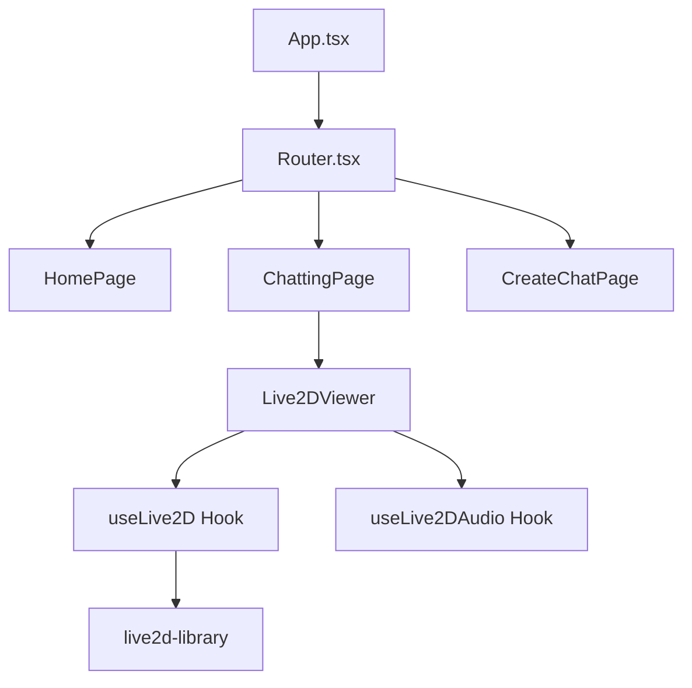

# ISEKAI-FE 변경사항 문서

## 📅 2025년 12월 31일 기준

---

## 🎯 주요 변경 사항 요약

기존 Vanilla TypeScript 기반의 Live2D 구현에서 **React 기반 아키텍처**로 전면 리팩토링되었습니다.

### 핵심 변경점
1. **React 앱 구조로 전환**: 기존 `main.ts` → `main.tsx`, `App.tsx` 기반 SPA 구조
2. **컴포넌트 기반 Live2D 뷰어**: 재사용 가능한 `Live2DViewer` 컴포넌트 생성
3. **커스텀 훅 도입**: Live2D 로직을 React 훅으로 분리
4. **ZIP 메모리 로딩**: 모델을 ZIP 파일에서 직접 메모리로 로드하는 기능 추가
5. **페이지 라우팅**: React Router 기반 페이지 구조 도입

---

## 📁 파일 구조 변경

### 삭제된 파일 (기존 Root 레벨)

| 파일명 | 설명 |
|--------|------|
| `src/main.ts` | 기존 진입점 |
| `src/lappdefine.ts` | 앱 정의 상수 |
| `src/lappdelegate.ts` | 앱 델리게이트 |
| `src/lappglmanager.ts` | GL 매니저 |
| `src/lapplive2dmanager.ts` | Live2D 매니저 |
| `src/lappmodel.ts` | 모델 클래스 |
| `src/lapppal.ts` | 플랫폼 추상화 레이어 |
| `src/lappsprite.ts` | 스프라이트 클래스 |
| `src/lappsubdelegate.ts` | 서브 델리게이트 |
| `src/lapptexturemanager.ts` | 텍스처 매니저 |
| `src/lappview.ts` | 뷰 클래스 |
| `src/lappwavfilehandler.ts` | WAV 파일 핸들러 |
| `src/touchmanager.ts` | 터치 매니저 |
| `src/websocket/websocketmanager.ts` | 웹소켓 매니저 |
| `src/websocket/audioStreamManager.ts` | 오디오 스트림 매니저 |
| `src/components/chatmanager.ts` | 채팅 매니저 |
| `style/chatpage.css` | 채팅 페이지 스타일 |
| `style/subtitle.css` | 자막 스타일 |
| `style/fonts/netmarble_font/*` | Netmarble 폰트 파일들 |

### 신규 생성된 파일

```
src/
├── App.tsx                          # [NEW] React 앱 루트 컴포넌트
├── main.tsx                         # [NEW] React 앱 진입점
├── components/
│   └── Live2DViewer.tsx             # [NEW] Live2D 뷰어 컴포넌트
├── hooks/
│   ├── useLive2D.ts                 # [NEW] Live2D 초기화/렌더링 훅
│   └── useLive2DAudio.ts            # [NEW] 오디오 스트리밍 훅
├── pages/
│   ├── Router.tsx                   # [NEW] 라우터 설정
│   ├── Home/
│   │   └── page.tsx                 # [NEW] 홈 페이지
│   ├── Chatting/
│   │   └── page.tsx                 # [NEW] 채팅 페이지
│   └── CreateChat/
│       └── page.tsx                 # [NEW] 채팅 생성 페이지
├── live2d-library/                  # [NEW] Live2D 코어 라이브러리
│   ├── lappdefine.ts
│   ├── lappdelegate.ts
│   ├── lappglmanager.ts
│   ├── lapplive2dmanager.ts
│   ├── lappmodel.ts
│   ├── lapppal.ts
│   ├── lappsprite.ts
│   ├── lappsubdelegate.ts
│   ├── lapptexturemanager.ts
│   ├── lappview.ts
│   ├── lappwavfilehandler.ts
│   ├── touchmanager.ts
│   ├── chat/
│   │   └── chatmanager.ts
│   └── websocket/
│       ├── websocketmanager.ts
│       └── audioStreamManager.ts
└── style/                           # [NEW] 스타일 디렉토리
```

---

## 🔧 아키텍처 변경

### React 컴포넌트 구조



### Live2DViewer 컴포넌트

[Live2DViewer.tsx](file:///Users/lewis/Desktop/ISEKAI-FE/Samples/TypeScript/Demo/src/components/Live2DViewer.tsx)

**Props:**
```typescript
interface Live2DViewerProps {
    modelUrl?: string;          // ZIP URL (기본값: CDN에서 haru 모델)
    modelConfig: Live2DModelConfig;  // 모델 설정 (감정 맵, 키 맵 등)
    webSocketUrl?: string;      // WebSocket 서버 URL
}
```

**주요 기능:**
- ZIP 파일에서 모델 자동 로드
- 메모리 기반 리소스 관리
- 컨테이너 크기에 자동 적응

---

### useLive2D 훅

[useLive2D.ts](file:///Users/lewis/Desktop/ISEKAI-FE/Samples/TypeScript/Demo/src/hooks/useLive2D.ts)

**입력:**
```typescript
interface UseLive2DProps {
    containerRef: React.RefObject<HTMLElement>;
    modelConfig: Live2DModelConfig;
    modelPath: string;
    modelFileName: string;
    resources?: Map<string, ArrayBuffer>;
}
```

**반환:**
```typescript
{ manager: LAppLive2DManager | null }
```

**책임:**
1. CubismFramework 초기화
2. Canvas 생성 및 컨테이너에 추가
3. LAppSubdelegate 초기화
4. 모델 로드 (파일 또는 메모리)
5. 애니메이션 루프 관리
6. 클린업 처리

---

### useLive2DAudio 훅

[useLive2DAudio.ts](file:///Users/lewis/Desktop/ISEKAI-FE/Samples/TypeScript/Demo/src/hooks/useLive2DAudio.ts)

**입력:** `serverUrl: string`

**반환:**
```typescript
{
    isConnected: boolean;
    error: Error | null;
    getCurrentRms: () => number;
}
```

**책임:**
- WebSocket 연결 관리
- 오디오 스트리밍
- RMS (볼륨) 값 제공

---

## 🆕 새로운 기능

### 1. ZIP 메모리 로딩

모델을 ZIP 파일에서 직접 메모리로 로드할 수 있습니다:

```typescript
// Live2DViewer에서 자동 처리
<Live2DViewer modelUrl="/Resources/ANIYA.zip" ... />
```

**내부 동작:**
1. `axios`로 ZIP 파일 다운로드
2. `JSZip`으로 압축 해제
3. 모든 파일을 `Map<string, ArrayBuffer>`로 저장
4. `.model3.json` 파일 자동 탐지
5. `useLive2D` 훅에 리소스 맵 전달

### 2. 외부 설정 주입

[LAppLive2DManager](file:///Users/lewis/Desktop/ISEKAI-FE/Samples/TypeScript/Demo/src/live2d-library/lapplive2dmanager.ts)에 외부 설정 주입:

```typescript
interface Live2DModelConfig {
    emotionMap: { [key: string]: string };  // 감정 → 표정 매핑
    keyMap?: { [key: string]: string };     // 키 → 액션 매핑
    voiceMap?: { [key: string]: string };   // 음성 → 파일 매핑
    layout?: ModelLayout;                    // 레이아웃 오버라이드
}
```

### 3. 다중 모델 지원

한 페이지에서 여러 Live2D 모델을 독립적으로 렌더링할 수 있습니다:

```tsx
// ChattingPage에서 3개의 모델 동시 렌더링
<Live2DViewer modelUrl="/Resources/ANIYA.zip" ... />
<Live2DViewer modelUrl="/Resources/ANIYA.zip" ... />
<Live2DViewer modelUrl="/Resources/ANIYA.zip" ... />
```

### 4. 외부 립싱크 제어

[LAppModel.setLipSyncValue](file:///Users/lewis/Desktop/ISEKAI-FE/Samples/TypeScript/Demo/src/live2d-library/lappmodel.ts#L639-L644) 메서드로 외부에서 립싱크 값을 직접 설정할 수 있습니다:

```typescript
model.setLipSyncValue(rmsValue);  // 0.0 ~ 1.0
```

---

## 📦 의존성 변경

### 추가된 패키지
- `react`
- `react-dom`
- `react-router-dom`
- `axios`
- `jszip`

### 설정 파일 변경

#### vite.config.mts
- `@framework` alias 추가
- `@/` alias 추가 (src 경로)
- React 플러그인 설정

#### tsconfig.json
- `paths` 설정 업데이트
- JSX 설정 추가

---

## 🛣️ 라우팅 구조

| 경로 | 컴포넌트 | 설명 |
|------|----------|------|
| `/` | `HomePage` | 홈 페이지 |
| `/chatting` | `ChattingPage` | 채팅 페이지 (Live2D 모델 표시) |
| `/create-chat` | `CreateChatPage` | 채팅 생성 페이지 |

---

## 🔄 마이그레이션 가이드

### 기존 코드에서 마이그레이션

**이전 (Vanilla TS):**
```typescript
import { LAppDelegate } from './lappdelegate';
LAppDelegate.getInstance().run();
```

**현재 (React):**
```tsx
import Live2DViewer from '@/components/Live2DViewer';

const MyPage = () => (
    <Live2DViewer
        modelUrl="/Resources/Model.zip"
        modelConfig={{ emotionMap: { happy: 'exp_01' } }}
    />
);
```

---

## ⚠️ 주의사항

1. **WebGL 컨텍스트**: 여러 Live2DViewer 사용 시 각각 독립된 WebGL 컨텍스트 사용
2. **메모리 관리**: 컴포넌트 언마운트 시 자동으로 리소스 해제
3. **ZIP 로딩**: 네트워크에서 ZIP 로드 시 CORS 정책 확인 필요

---

## 📝 향후 계획

- [ ] WebSocket 오디오 스트리밍과 Live2D 립싱크 연동
- [ ] 감정 표현 API 연동
- [ ] 모델 전환 애니메이션
- [ ] 터치/클릭 인터랙션 개선
